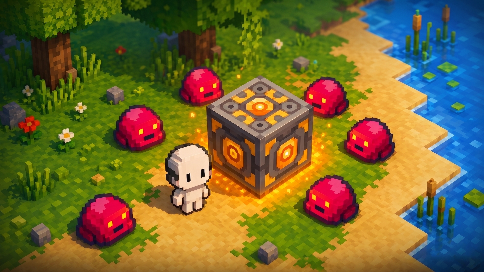

# Craftorio

**Craftorio** is a 2D automation, factory-building and base-defense game built with **Java** and **LibGDX**. It is heavily inspired by *Factorio* and *Mindustry*.

You are dropped into a procedurally generated world next to your **Core**. Mine raw ores, smelt them, automate complex production chains with conveyor belts, pipes and an electrical grid, defend your factory against escalating waves of enemies, and ultimately assemble and **launch a Rocket** to win.

---

## Table of Contents

1. [Tech Stack & Requirements](#tech-stack--requirements)
2. [How to Run the Project](#how-to-run-the-project)
3. [Game Objective (Win / Lose)](#game-objective-win--lose)
4. [Controls](#controls)
5. [World & Terrain](#world--terrain)
6. [The Player](#the-player)
7. [Buildings Overview](#buildings-overview)
8. [Production System](#production-system)
9. [Conveyor / Logistics System](#conveyor--logistics-system)
10. [Liquid System](#liquid-system)
11. [Power / Energy System](#power--energy-system)
12. [Defense System](#defense-system)
13. [Enemies](#enemies)
14. [Enemy Pathfinding](#enemy-pathfinding)
15. [Wave System](#wave-system)
16. [Project Structure](#project-structure)

---

## Tech Stack & Requirements

| Component | Detail |
| :--- | :--- |
| **Language** | Java |
| **Framework** | LibGDX |
| **Desktop backend** | LWJGL3 |
| **Build tool** | Gradle (wrapper included) |
| **World generation** | Procedural OpenSimplex2 noise (`FastNoiseLite`) |

**Requirements to build & run:**

* A modern **JDK** (the version is defined in the Gradle build files). The Gradle `foojay-resolver` plugin can auto-download a matching toolchain.
* No manual LibGDX install is needed — Gradle resolves all dependencies.

---

## How to Run the Project

The game is split into two Gradle modules:

* `core` — all game logic, model, view and controllers (platform-independent).
* `lwjgl3` — the desktop launcher (`Lwjgl3Launcher`) that packs textures and starts the application.

### Run directly from source (recommended)

From the project root:

```bash
# macOS / Linux
./gradlew lwjgl3:run

# Windows
gradlew.bat lwjgl3:run
```

> On macOS the `run` task automatically adds the required `-XstartOnFirstThread` JVM argument, so no extra setup is needed.

On the first launch the launcher packs all images from `assets/raw/` into a texture atlas (`assets/atlas/main_atlas.atlas`), so the first start may take a little longer.

### Build a runnable JAR

```bash
./gradlew lwjgl3:jar
```

The output JAR is written to `lwjgl3/build/libs/`. Run it with:

```bash
# Generic
java -jar lwjgl3/build/libs/<jar-name>.jar

# macOS (needs the first-thread flag)
java -XstartOnFirstThread -jar lwjgl3/build/libs/<jar-name>.jar
```

There are also platform-specific JAR tasks (smaller output): `jarWin`, `jarMac`, `jarLinux`, and native packaging via the `construo` plugin.

### Main menu options

When you start the game you land on the main menu, where you can toggle:

* **Enable Music** — turns the soundtrack on/off.
* **Infinite Resources** — relaxes resource constraints for casual/testing play.
* **Disable Enemies** — turns off wave spawning entirely (peaceful/sandbox mode).

Press **START GAME** to generate a new world and spawn next to your Core.

---

## Game Objective (Win / Lose)

* **Win:** Build a **Rocket** and fully supply it with the required **Chips**, **Steel**, and **Rocket Fuel**. Once filled, it launches and you reach the **Win Screen**.
* **Lose:** Your **Core** is the heart of your base. If enemies destroy it (its HP reaches 0), the game is over and you are sent to the **Lose Screen**.

Everything else — production, logistics, power and defense — exists to serve these two goals: keep the Core alive while building toward the rocket.

---

## Controls

### Movement & Camera

| Action | Input |
| :--- | :--- |
| Move | `W` `A` `S` `D` or Arrow Keys |
| Zoom In | `+` or `=` |
| Zoom Out | `-` |
| Mine resource by hand | Hold `Space` while standing still on an ore tile |
| Pause / Unpause | `P` |

> Manual mining: stand on an ore cell, stop moving, and hold `Space`. After a short delay a single ore unit is added to your inventory. Moving cancels the dig.

### Building Hotkeys

| Key | Building | Key | Building |
| :--- | :--- | :--- | :--- |
| `1` | Miner | `9` | Coal Generator |
| `2` | Belt | `0` | Power Pole |
| `3` | Horizontal Miner | `Y` | Pipe |
| `4` | Assembler | `U` | Pump |
| `5` | Turret | `I` | Furnace |
| `6` | Junction | `O` | Chemical Plant |
| `7` | Router | | |
| `8` | Wall | | |

> Buildings without a hotkey (Laser Turret, Oil Generator, Accumulator, Liquid Junction/Router, Underground Belt/Pipe, Rocket) can be selected from the **Build Menu** panel in the bottom-right corner. Click the `[?]` help button in the menu to see info about the selected building.

### Building & Interaction

| Action | Input |
| :--- | :--- |
| Place building | `Left Mouse Button` (click or drag for lines) |
| Rotate building | `R` (while a building is selected) |
| Erase mode | Hold `Shift` + `Left Mouse Button` (click or drag) |
| Clear selection | `Escape` |
| Open machine UI (recipe picker) | `Left-Click` an existing Assembler / Furnace / Chemical Plant |
| Open Rocket UI | `Left-Click` the Rocket |
| Close any UI | `Escape` |

### Debug

| Action | Input |
| :--- | :--- |
| Spawn an enemy at cursor | `Right Mouse Button` (when no build tool is selected) |

---

## World & Terrain

The map is a large grid generated with layered OpenSimplex2 noise. Each cell has a **terrain type** and optionally a **resource**.

### Terrain types

| Terrain | Walkable | Notes |
| :--- | :--- | :--- |
| **Grass** | Yes | Default buildable ground |
| **Sand** | Yes | Buildable ground (low terrain) |
| **Wall** (rock) | No | Natural obstacle, blocks movement & enemies |
| **Water** | No | Source of **Water** liquid |
| **Oil** | No | Source of **Oil** liquid |

Buildings cannot be placed on non-walkable terrain. Both the player and enemies treat `Wall`, `Water` and `Oil` tiles as impassable.

### Resources (ores)

Ores are scattered in patches on Grass/Sand tiles. Each ore has its own mining difficulty, so some are extracted faster than others:

| Resource | Drop |
| :--- | :--- |
| **Iron** | Iron Ore |
| **Copper** | Copper Ore |
| **Coal** | Coal |

A `Miner` placed over ore tiles extracts these automatically; the player can also mine them by hand with `Space`.

---

## The Player

The player is the avatar you control directly. Properties:

* Moves with smooth diagonal normalization (no speed boost on diagonals).
* Collides with non-walkable terrain and non-walkable buildings.
* Has an **Inventory** that holds mined ores and crafted items. Building costs are paid from this inventory.
* Can manually mine ore (`Space`).

The starting inventory is seeded with some basic ore so you can begin building immediately.

---

## Buildings Overview

All placeable buildings, their footprint and role:

| Building | Size | Role |
| :--- | :--- | :--- |
| **Core** | 3×3 | Your base. Must be protected. Accepts any item (stores it in inventory). |
| **Miner** | 2×2 | Mines ores under its footprint. |
| **Horizontal Miner** | 1×3 | Continuously produces **Stone**. |
| **Belt** | 1×1 | Conveyor; moves items. |
| **Junction** | 1×1 | Lets two item lanes cross without mixing. |
| **Router** | 1×1 | Distributes items round-robin to all sides. |
| **Underground Belt** | 1×1 | Tunnels items under other buildings. |
| **Assembler** | 2×2 | Crafts bullets, steel bullets, chips. (Uses power) |
| **Furnace** | 2×2 | Smelts ores into ingots, steel, glass. (Uses power) |
| **Chemical Plant** | 2×2 | Processes liquids: plastic, rocket fuel. (Uses power) |
| **Pipe** | 1×1 | Transports liquids. |
| **Pump** | 1×1 | Extracts liquid from Water/Oil tiles. |
| **Liquid Junction** | 1×1 | Crossing for two liquid lines. |
| **Liquid Router** | 1×1 | Splits a liquid line. |
| **Underground Pipe** | 1×1 | Tunnels liquid under buildings. |
| **Coal Generator** | 1×1 | Burns coal for electricity. |
| **Oil Generator** | 2×2 | Burns oil for electricity. |
| **Accumulator** | 1×1 | Battery: stores surplus power. |
| **Power Pole** | 1×1 | Extends/links the power grid. |
| **Turret** | 1×1 | Fires ammo at enemies. |
| **Laser Turret** | 1×1 | Beam weapon. (Uses power) |
| **Wall** | 1×1 | High-HP barrier to block/slow enemies. |
| **Rocket** | 4×4 | Win condition; consumes Chips, Steel, Rocket Fuel. |

Each building's footprint, durability (HP) and build cost are defined in code (`BuildingType`); see that file for current values.

Most buildings extend `DamageableBuilding`: they have HP, flash when hit, and are removed when destroyed (which also lets enemies path through where they used to be).

---

## Production System

Production buildings turn inputs into outputs over time. Crafting buildings (`Furnace`, `Assembler`, `Chemical Plant`) share a common **`CraftModule`** that:

* Holds an input buffer, an output buffer, and a current recipe.
* Only accepts items/liquids that the **selected recipe** requires.
* Crafts at a rate scaled by the **power satisfaction ratio** (a power-starved machine crafts proportionally slower).
* Auto-ejects finished products onto adjacent belts/buildings.

Select a recipe by left-clicking the machine to open its crafting UI.

### Miners

* **Miner:** Scans the ore tiles under its footprint and extracts whatever ores it covers. Multiple covered tiles of the same ore stack, so more coverage means faster output. It outputs around its perimeter to any adjacent receiver.
* **Horizontal Miner:** A simple generator that continuously produces **Stone** and pushes it out of its front.

### Crafting

Each crafting building offers its own set of selectable recipes:

* **Furnace** — smelts ores into ingots, and combines ingots/materials into higher tiers (steel, glass, …).
* **Assembler** — builds combat and tech items such as bullets, steel bullets and chips.
* **Chemical Plant** — processes liquids and produces materials like plastic and rocket fuel.

All recipes (their inputs, outputs and craft times) are defined in code (`Recipe`); the in-game crafting UI always shows what each machine can make.

A typical end-game flow chains these together: ores are smelted into ingots and steel, oil is refined into plastic and rocket fuel, plastic and copper become chips — and steel, chips and rocket fuel ultimately feed the Rocket.

---

## Conveyor / Logistics System

Items move across the factory on **belts** and related logistics buildings.

### Belts

* Carry items toward whatever sits in front of them at a fixed conveyor speed.
* Items have a continuous **progress** value along the belt; the system prevents items from overlapping and handles back-pressure (items stop if the next belt/machine is full or blocked).
* Belts auto-detect neighbors to choose their visual/logical shape (straight, curve, T-junction, merge) — you do not configure this manually; just place and rotate (`R`) them.
* A belt hands its lead item to whatever `ReceiveItem` building sits in front of it.

### Junction

A 1×1 crossing with independent **per-side buffers**. Items keep their travel direction and pass *through* after a fixed travel time, so two belt lines can cross at 90° without their contents mixing.

### Router

Takes one item at a time, holds it briefly, then pushes it out in **round-robin** order to whichever side can accept it. Useful for evenly splitting a stream across multiple consumers.

### Underground Belt

Placed as a linked **input/output pair**, it carries items *underneath* other buildings or obstacles between the two endpoints, then resumes onto a normal belt. The output end refuses items coming back from its own front to avoid loops.

---

## Liquid System

Liquids (**Water**, **Oil**, **Rocket Fuel**) flow through a connected **pipe network** rather than as discrete items.

### How it works

* **Pump:** Placed on a Water or Oil tile, it extracts that liquid and pushes it into adjacent receivers, splitting its output among all valid neighbors.
* **Pipes / Liquid Junctions / Liquid Routers / Underground Pipes** connect to form a **`LiquidNetwork`**.
* A liquid network is a set of connected nodes that **share one pooled volume**. Its total capacity is the sum of all member pipes, and it tracks a single fill ratio shared by all members, so liquid "levels out" instantly across connected pipes.
* A network holds **one liquid type at a time**; it won't accept a different type until it's empty. This prevents accidental mixing of water and oil.
* The `LiquidNetworkManager` rebuilds networks (via BFS over connected nodes) whenever the pipe layout changes, preserving previous fill levels and liquid type.

### Consumers/producers of liquid

* **Chemical Plant** — consumes Water/Oil, produces Plastic (item) and Rocket Fuel (liquid).
* **Oil Generator** — consumes Oil to produce power.
* **Rocket** — consumes Rocket Fuel.

---

## Power / Energy System

Buildings that craft or fire (Furnace, Assembler, Chemical Plant, Laser Turret) need **electricity**. Power is generated, optionally stored, and distributed over a **power network**.

### Network formation

* Every powered building owns a **`PowerNode`**. Generators, consumers, accumulators and **Power Poles** are all `PowerConnectable`.
* Nodes connect to other nearby nodes within a fixed radius. **Non-pole buildings only connect to Power Poles**, while Power Poles connect to everything nearby — so poles act as the backbone that links machines to generators.
* Connected nodes merge into a single **`PowerNetwork`**. Removing a building re-evaluates and splits/merges affected networks.

### Per-tick balancing

Each tick, every network computes:

1. **Total demand** from consumers (only machines actively crafting/firing draw power).
2. **Total supply** from producers.
3. **Battery** charge space and available discharge.

Then it resolves the balance:

* **Surplus:** consumers are fully powered; excess charges accumulators; producers throttle their fuel burn to match the real load.
* **Deficit:** accumulators discharge to cover the gap. If batteries can't fully cover it, all consumers receive a **fractional satisfaction ratio** — they keep running, just slower/weaker.

Network status is one of: `IDLE`, `POWERED`, `DEFICIT`, `BLACKOUT`.

### Power buildings

* **Coal Generator** — burns buffered Coal to produce electricity.
* **Oil Generator** — burns Oil (supplied via pipes) to produce electricity.
* **Accumulator** — a battery that stores surplus power and discharges it during deficits.

Exact production, consumption and storage values live in the balance/configuration files in code.

---

## Defense System

Three buildings keep your factory alive.

### Turret (ammo-based)

* Fires at enemies within range whenever it has ammo loaded.
* Holds a limited number of rounds. Ammo is delivered like any item (via belts) and must be one of the accepted bullet types.
* Always targets the **nearest** enemy and rotates to aim.

**Ammo / Bullet types:**

| Ammo (item) | Bullet type | Notes |
| :--- | :--- | :--- |
| Copper Ore | Copper | Cheap early-game ammo, fed directly. |
| Bullet | Standard | Crafted; better than raw ore. |
| Steel Bullet | Piercing | Crafted; passes through and devastates even heavy enemies. |

### Laser Turret (power-based)

* Deals continuous damage to the nearest target — no ammo needed, longer range than the basic turret.
* Consumes power while firing, and its actual damage scales with the network's power satisfaction, so an under-powered laser is weaker.

### Wall

* A cheap, high-HP barrier. Walls don't attack, but they block enemy movement and soak damage, funneling enemies into your turret kill-zones. Because the pathfinder weighs building HP as a traversal cost, walls also make enemies *prefer* to go around rather than chew through.

---

## Enemies

Enemies spawn far from your base and stream toward the **Core**, attacking any building in their way. There are three archetypes:

| Type | Role |
| :--- | :--- |
| **Basic** | Standard, numerous; the backbone of most waves. |
| **Fast** | Quick flanker with low HP that attacks rapidly. |
| **Fat** | Slow tank with huge HP and damage; wrecks buildings. |

Their exact stats (HP, speed, damage, attack cooldown, hitbox) are defined in code (`EnemyType`).

### Enemy behavior

Each tick an enemy:

1. Samples the **flow field** to get a direction toward the Core (interpolated smoothly between grid cells).
2. Adds a **separation force** so enemies in a crowd push apart instead of stacking on one tile.
3. Tries to move along the combined vector. If movement is blocked:
   * It **attacks the obstacle** in front of it. If that obstacle is a `DamageableBuilding` (wall, belt, turret, etc.), it deals its damage (respecting its attack cooldown).
   * It then tries to **slide** along just the X or Y axis to flow around obstacles.

Large enemies use a separate "heavy" navigation layer (see below).

---

## Enemy Pathfinding

Craftorio uses a **Flow-Field (vector field) pathfinder** rather than per-enemy A*. This scales to hundreds of enemies cheaply because the path is computed **once for the whole map**, and every enemy just reads a precomputed direction from its cell.

### How the flow field is built (`PathFinder`)

1. **Integration field (Dijkstra):** Starting from the **Core**, a Dijkstra/priority-queue flood-fill computes the travel *cost* to reach the Core from every reachable cell, using weighted costs for orthogonal vs. diagonal moves.
2. **Building penalties:** Walkable buildings add cost. A `DamageableBuilding` contributes a penalty based on its **HP** (so high-HP walls are "expensive" to walk through and enemies prefer to route around them); other obstacles add a flat large penalty. Non-walkable terrain (water, rock) is fully blocked.
3. **Vector field:** For each cell, the pathfinder looks at its neighbors and points toward the one with the lowest cost — producing a per-cell direction vector that always leads "downhill" toward the Core.
4. **Hash-based noise:** A small deterministic per-cell/per-direction noise is mixed into the comparison so streams of enemies spread out across multiple equally-good routes instead of forming a single thin line.

### Two size classes (layered flow fields)

The pathfinder maintains **two** independent flow fields:

* **SMALL** — used by light enemies (Basic & Fast).
* **HEAVY** — used by large enemies (Fat). The heavy field adds padding around obstacles, so big enemies don't try to squeeze through gaps too narrow for their hitbox.

Enemies choose their layer based on hitbox size and then sample/interpolate the corresponding field.

### Performance design

* The flow field is recomputed periodically on a **background thread**, so building changes are eventually reflected without stalling the render loop.
* **Double buffering:** results are written into an inactive buffer and atomically swapped in (`volatile activeData`), so enemies always read a complete, consistent field.
* A **node object pool** avoids per-frame garbage during the Dijkstra pass.

---

## Wave System

Enemy attacks come in **waves**, managed by `WaveSpawner`. (Disabled entirely if you checked *Disable Enemies* in the menu.)

### Scripted waves

The game ships with a sequence of **predefined waves** of escalating difficulty, each arriving from a chosen compass direction (North / South / East / West) and mixing the enemy archetypes in growing numbers.

* A new wave arrives after a period of "peace".
* A wave is considered **active** until every enemy from it is dead; only then does the timer for the next wave start. The on-screen Wave UI shows the upcoming wave, its direction (via an arrow), and the countdown.

### Infinite / Sudden-Death mode

After the scripted waves are cleared, the game enters **infinite mode**:

* Procedural waves spawn from a **random direction** on a much shorter timer.
* Each successive wave grows larger across all enemy types, so the pressure ramps up relentlessly. This is effectively an endless survival challenge.

### Spawning logic

* Enemies spawn in a band beyond the edge of your built area, on the chosen side of the base.
* The spawner only picks spawn cells that are **walkable and clear** enough for the largest enemy in the wave, then scatters enemies randomly within that pool.

(Wave counts, timers and spawn distances are all configured in `WaveSpawner`.)

---

## Project Structure

The codebase follows a clean **Model–View–Controller** separation:

```
core/src/main/java/io/github/craftorio/
├── MainGame.java                # LibGDX Game entry; shows the main menu
├── GameScreen.java              # Main loop: fixed-timestep simulation + rendering + threading
├── MainMenuScreen / WinScreen / LoseScreen
├── GameConfig.java              # World size, tick rate, global toggles
├── BalanceConfig.java           # All gameplay tuning constants (speeds, damage, power, ...)
│
├── controller/                  # Input handling
│   ├── PlayerController          # Movement, zoom, manual digging
│   ├── BuildInputHandler         # Build hotkeys, placement, rotation, erase
│   ├── WorldInteractionHandler   # Click machines/rocket to open UIs
│   └── DebugInputHandler         # Right-click enemy spawn
│
├── model/
│   ├── core/                    # SimulationEngine, BuildingRegistry, BuildingManager, WorldMap
│   ├── building/                # Building base types + interfaces (ReceiveItem, ThroughLiquid, ...)
│   │   ├── production/           # Miner, Furnace, Assembler, ChemicalPlant, Pump, Rocket, CraftModule
│   │   ├── logistics/            # Belt, Junction, Router, Underground belts/pipes, Pipe
│   │   ├── liquid/               # LiquidNetwork(+Manager/Node)
│   │   ├── power/                # PowerNetwork, PowerNode, generators, Accumulator, PowerPole
│   │   ├── defense/              # Turret, LaserTurret, Wall
│   │   └── storage/              # Core
│   ├── enemy/                   # Enemy, EnemyType, PathFinder, Wave, WaveSpawner, SpawnDirection
│   ├── entity/                  # Player, Bullet, PiercingBullet, BulletType
│   ├── generator/               # MapGenerator, FastNoiseLite, Cell, TerrainType, ResourceType
│   └── item/                    # ItemType, LiquidType, Recipe
│
├── ui/                          # BuildTool, Inventory, PreviewState (logical UI state)
└── view/                        # Cameras, renderers (layered), sprites, and on-screen UI
    ├── layers/                   # Per-layer renderers (map, belts, buildings, enemies, bullets, flow-field debug, ...)
    └── ui/                       # BuildMenu, Crafting, Inventory, Rocket, Wave, Player HUDs
```

> All tunable values — map size, tick rate, recipes, building stats, enemy stats, power numbers and wave definitions — live in dedicated configuration/enum files (`GameConfig`, `BalanceConfig`, `Recipe`, `BuildingType`, `EnemyType`, `WaveSpawner`). This README intentionally describes *how the systems work* rather than listing specific numbers, which may change as the game is balanced.

### Simulation loop

`GameScreen` runs a **fixed-timestep** loop. Each tick, `SimulationEngine`:

1. Applies pending building add/remove changes.
2. Rebuilds liquid networks if the pipe layout changed.
3. Updates every building, collects their power networks, and updates each network.
4. Ticks liquid networks.
5. Updates all enemies, then all bullets.
6. Updates the wave spawner.

Rendering, the pathfinding thread, and audio (calm OST vs. combat music during active waves) run alongside this loop.

---

*Craftorio — mine, automate, defend, and launch.*
